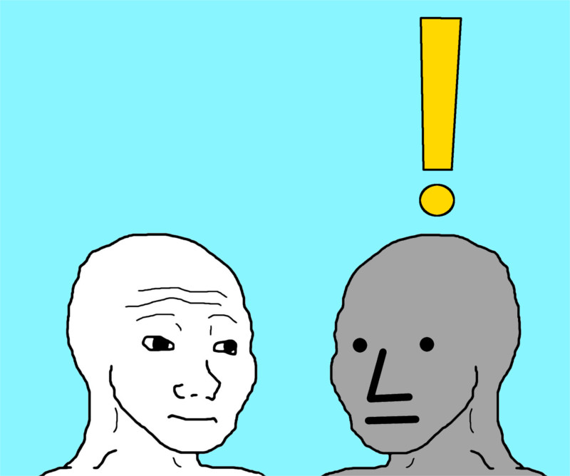
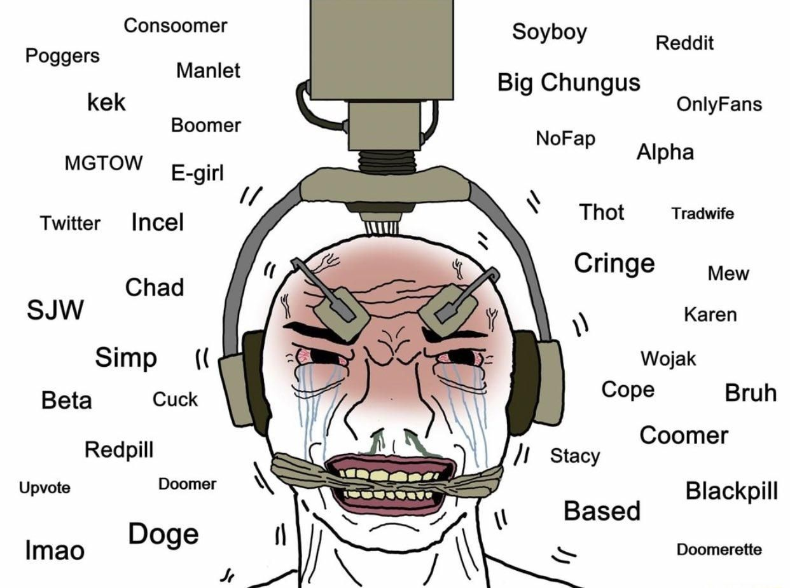
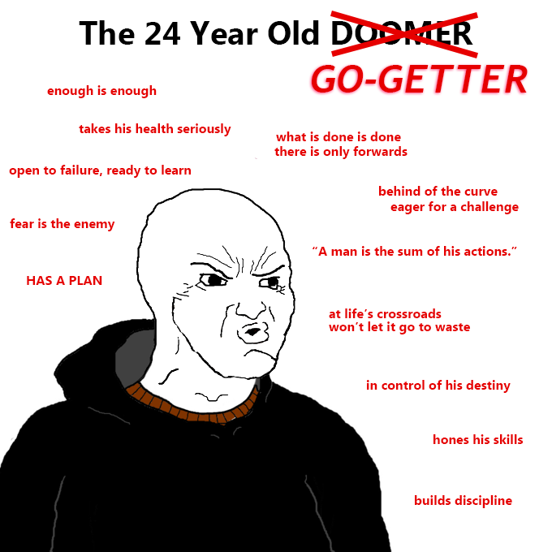

# And am I the main figure in my movie?
This question popped up and I think it does have sort of an answer.

 

 ## First, some definitions
##### Know Your Memes defines *NPC* as
 ```
A depiction of the MS Paint character Wojak with a blank stare and facial expression,
named after non-player characters within video games.
The character is meant to represent people who do not think for themselves or
are incapable of having an internal monologue,
bearing many similarities to the terms "basic" and "normie".

 ```
 ##### Another helpful definition is *dissociation*
 ```
 Dissociation is a mental process of disconnecting from one’s thoughts, feelings,
 memories or sense of identity.
 ```

 ##  Is possible to not think for yourself?

 I would say no. I refuse to think that this is possible. Even tho I read it from time to time (and sometimes even hear it),
 I find it very hard to grasp this concept.

 I mean (_buzzword alert_) tHe sOcIaL mEdIa Is TaKiNg OvEr blabla... I still don't think NPC's do really exist.
 The only thing I'm sure about is that soycial media may mitigate one's thought process if used incorrectly. But
 everyone thinks. Everyone has to ask questions like <a href="https://www.youtube.com/watch?v=jgKqOxCOD8g">where am I? What am I doing here?</a>

 ## But the what about the story part?

 **The story of your life**... A queer concept if you think about it. I couldn't trace the origins of it but I'm
 pretty sure I saw folklore tales about it. And I'm pretty sure everybody plays this game. Or writes his story.
 Maybe it's just natural to look back at yourself and feel like you've played in a movie,
 be it good or bad, fortunate or tragic.

 ## How can doubt arise?


 In a world full of information (or rather content) that is extremely available and tailored to the point we don't even
 have to search for it, how can we be sure we haven't fallen from the spotlight?

  

  The problem goes even further then that. This concern isn't primarily caused by what content we consume since(speaking
  from personal experience), the basic go-to villans like social media and tv and stuff like, while still being cringe,
  are not the absolut evil that the main character of our story have to defeat in order for things to magially solve.
  While torrenting movies is definetly cooler than watching Netflix, I don't think that this is the final answer.

To some extent is sort of inevitable to feel left out of your own reality when dissociation has become
  so facile. And even if you're not an active presence, but a pseudo-anon (evidently, the degree of anonymity offered
  by platforms like Sojbook or Instagram is rather *frêle*), it still feels soooo good.

  It's easy to point out at the things you don't like about yourself and blame them for your current state.
  While I think that some consumption habits are better than the others, I do not think that oUr sToRiEs are dependent on
  that. Also, it's even easier to let the things stay the way they are, as we all know. The concept of "being your best self"
  has become a sinister meme to say the least and it enforced this idea that a fufilled person must not have any fun
  and should reject any shallow guilty pleasure the modern age has to offer. The fact that ***unproductive activities*** are
  seen as a supreme cockblock accentuates the anxiety and the feeling of being left out. This image, aside from the
  fact that makes a very boring scene in your movie, is totally stupid. And I think most people acknowledge this but
  aren't totally convinced, thus choosing the "I don't do anything but I'm superior" kind of attitude. But, alas, this
  proves that NPC-s are just a meme.

  I don't suggest sitting all day procastrinating. I personally think that the solution to this "being left out" sort of
  thing rests in the degree of control we have over our lives. Or at least I know that taking control has helped me.

  ## What does taking control mean?
  

  #### Two things:
- This meme is kinda cringe but I haven't found anything better
- The answer to this question is simply _it depends_.

 I don't know if there's an answer for this question. Taking control isn't a magic solution for your
 problems or a single action you take. As with everything cool in life, there simply isn't a
 magic answer. And that's in my oppinion fantastic. That means that you can never get bored. And it's very exciting too.
 The only general thing I can think of is this: ***start questioning the simple regular things you do***. It may do wonders.
 A change doesen't always have to be big. And no movie is full of fight scenes.
