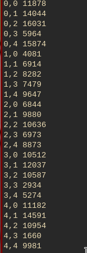

# MatrixMultiplication - MR

## Sarcina este următoarea:
```Proiectati si implementati o solutie MapReduce pentru a înmulti doua matrice(patratice).```

###### Soluție propusă:
- Fișierul de intrare conține pe fiecare rând informații ce descriu un rând al unei matrici
  (ex. M,0,0,63)
- În faza de mapare procesam fisierul de intrare pentru a obtine perechi de forma
**(i,k)(M,j,M_ij)** (pentru matricea M) si **(i,k),(N,j,N_jk)** (pentru matricea N), unde:
    - i = nr de coloane din matricea M
    - j = nr de coloane din M(si implicit nr de linii din N)
    - k = nr de coloane din N
    - M_ij/N_jk elementul din matrice aflat la indexul dat
- Etapa de combinare este executata cu ajutorul functiei sort din linux și in urma acesteia
tuplele generate in etapa de mapare pot fi procesate in functie de indecsii i,k.
- Etapa de reducere constă in următorii pasi:
    - Salvarea intr-o lista a tuturor valorilor din ambele matrici care au aceiasi cheie, sub forma de tuple
    care contin indexul si valoarea care se gaseste la o anumita cheie
    - Calcularea sumei produselor elementelor cu aceiasi cheie(partea efectiva de calcul a produsului matricii)
    - Pentru fiecare index din matricea reuzultat, returnarea cheii și valorii de interes.

###### Utilizare:
Pentru simplificarea procesului de rulare, este suficientă execuția unui script bash. Aceasta se poate realiza
apelând următoarea comandă:
```
	sh run.sh
```
###### Exemplu rezultat:




###### Bibliografie problema 2:
https://github.com/amberm291/MatrixMultiplyMR
