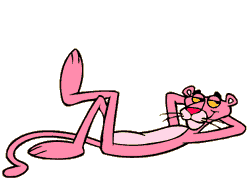

Ciao!

</img>

După cum am menționat și <a href="https://blog.pseudot.org/posts/exerci%C8%9Biu-de-scriere-0/exerci%C8%9Biu-de-scriere-0.html">aici</a>, în următoarea perioadă voi încerca să scriu zilnic câte ceva pe blog.
Însă, la nici 24 de ore de la publicarea primului text, am dat de primul impas.

Acum că mi s-a mai dus din entuziasm și am trecut la "execuție", încep să realizez cât de ciudat e să scrii. Am întors problema pe toate părțile, dar nu pot nici măcar să anticipez cum va arăta această serie de postări.
Singurele lucruri concrete până acum sunt tiltul și estetica paginii. De restul mă voi ocupa pe parcurs...

Astăzi, fiind în cautarea unei surse de inspirație, am dat peste un site absolut adorabil:<a href="https://gifcities.org/">GifCities</a>. Probabil că ăsta e site-ul care va influența cel mai mult aspectul viitoarelor articole. Și mi se pare că GIF-urile de acolo se potrivesc pur și simplu mănușă cu imaginea generala a blogului.

</img>

Tot astăzi am susținut în cadrul facultății cel mai greu examen din viața mea :)). Spre norocul meu, examenul a fost la materia mea preferată deci nu s-a pus problema de picat, am avut ce bâjbâi.

Examenul a constant într-un număr foarte mare de exerciții. Exagerat de mare. Din cauză că nu am avut suficient timp să rezolv toate sarcinile, la partea tehnică s-a adăugat o nouă componentă, aceea de "quick decision making" sau chiar "decision making under stress". Sincer să fiu, nu am privit cu ochi răi acest lucru. Nu cred că abilitatea de a te adapta la o situație neprevăzută strică cuiva. Sincer :)) Profesorul de curs ne-a spus cu alte ocazii că este fan al tehnicilor de învățare multidisciplinare, deci nu cred că structura examenului de azi a fost întâmplare.

</img>

În fine, am decis ca fiecare articol să se încheie cu o melodie. Pur și simplu nu puteam pierde ocazia de a distribui 30 de piese! :))

Melodia de astăzi: <a href="https://www.youtube.com/watch?v=FzpY3KQZ5p0">Frankie Negrón - Comerte a Besos (Salsa Version)</a>

Arrivederci!
