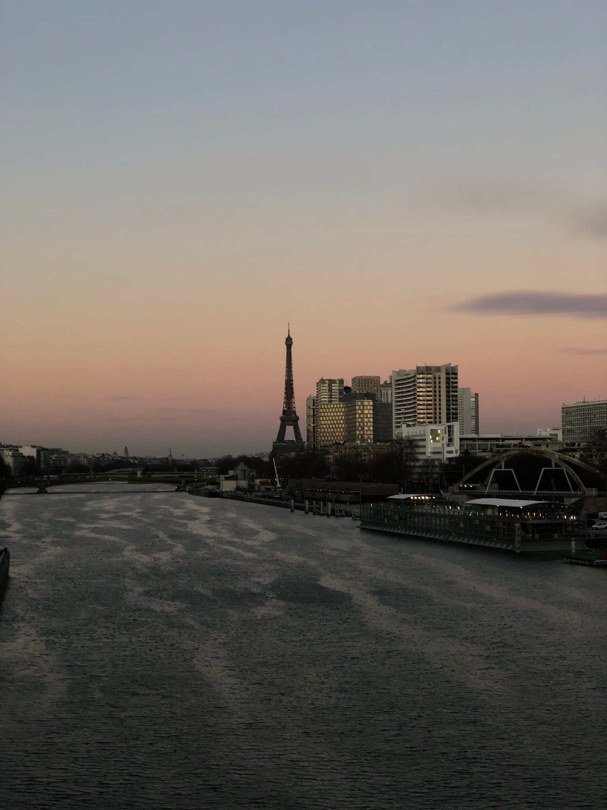

Ciao!

Am realizat într-un final, deși era deja clar, că nu mi-a ieșit...
Vorbesc desigur despre acest exercițiu de scriere. Premisa era să scriu
câte un post zilnic. Și n-am reușit...

Această lipsă de consecvență nu este cauzată de vreun deficit de idei (din contră chiar!).
Mai plauzibilă este absența chefului generată de lipsa de citiori :)) Pentru moment, asta e singura explicație care-mi vine în cap. Nu sunt însă convins că voi spune același lucru și în momentul postării cu numărul 30. În fine, on verra...

Zilele astea am mai deschis un site!:) <a href="https://catalog.pseudot.org">Check it out</a>. În momentul de față am urcat doar câteva poze cu niște pliante publicitare vechi (cca. 1900). Nu știu încă prea multe, mi-a fost lene să caut detalii. Dar abia aștept să o fac! Și sunt atât de norocos încât pot să văd pe viu cum arată astăzi halele și prăvăliile din reclame ( bineînțeles, dacă mai există).

Mai am și vreo 60 de cărți poștale din aceeași perioadă. Toate vederile au același destinatar(ă). În timp ce frunzăream prin ele am avut parte
de un sentiment foarte straniu. Mă simt de parcă am invadat intimitatea acelei persoane. Și, chiar dacă am văzut doar o părticică din corespondență ei, sunt sigur că am aflat niște detalii pe care cu mama, tata, sora, verișorii și fratele acestei «demoiselle» nu le-au știut niciodata;)

Voiam să atașez o poză cu o vedere (și să complimentez caligrafia textului de pe ea ), însă n-am nicio poză la îndemână și mi-e lene să aprind "светy" (becul) ca să fac una rapid.
Așa căăă, uite Turnul Eiffel :)))

Melodia zilei:

  ✨<a href="https://www.youtube.com/watch?v=eiCr_6-Chc4">Dani J- La Última Noche</a> ✨

 

Arrivederci!

